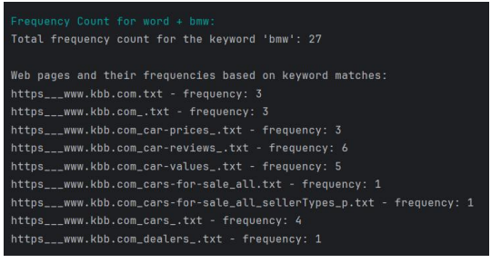

# Drive Dreams
Welcome to the official repository of Drive Dreams, a car price analysis tool. This repository contains the source code and documentation for the Drive Dreams.

## About 

The objective of this project is to develop a system that analyzes and understands carprices from various automobile websites to facilitate users in obtaining optimal deals. The project entails crawling three designated automobile websites, collecting relevant data, and presenting users with the best deals based on predefined parameters.

## Features 
**Web-Crawler :** Enables to traverse the internet, systematically scanning and indexing the content of various websites.    
**Search Frequency :** Designed to track the search frequency of words and store the data persistently in a CSV file.  
**Frequency Count :** Searches through all files in the directory, counts how many times the keyword appears in eachfile, andprovides the total frequency of the keyword across all files.  
**Spell suggestion :** Provides functionality for word completion based on a given input word.    
**Spell Checking :** Developed to identify and highlight potential spelling errors with ininput text by comparing words against a dictionary.  
**Page Ranking :** Ranks web pages stored in a directory based on their relevance to a specified keyword.  
**Inverted Indexing :** This feature implements an inverted index, which is used for information retrieval systemsand  to efficiently map words to the locations in documents.  
**Finding patterns using Regular Expression :** Implements a web scraper designed to extract car price data from a specified website.  
**HTML Parser :** Extracts valuable data from web pages which utilizes the Jsoup library.  
**Data Validation using Regular Expression:** This feature is utilized to match patterns, enabling the iterative confirmation of input until a valid input is provided.  

## Screenshots

## Contact 

For any inquiries or support, please contact at:

**Email**: dhairyadesai230@gmail.com
